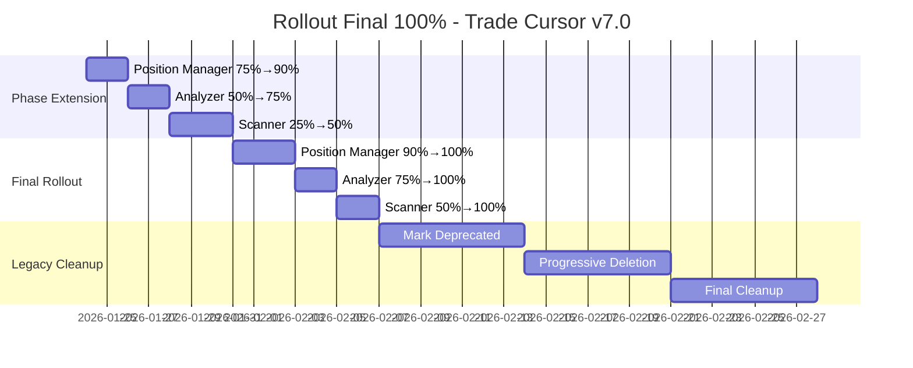

# STRATÉGIE ROLLOUT FINAL 100% - TRADE CURSOR V7.0
## Déploiement Complet Architecture Modulaire

---

## 🎯 **OBJECTIF FINAL - ROLLOUT 100%**

Finaliser la transformation architecturale complète de Trade Cursor v7.0 en passant **toutes les phases à 100% de rollout** avec dépréciation sécurisée du code legacy.

### **État Actuel (Post Phase 4)**
- **Position Manager (Phase 1):** 75% → Target: 100%
- **Analyzer (Phase 2):** 50% → Target: 100%  
- **Scanner (Phase 3):** 25% → Target: 100%

---

## 📊 **PLAN DE ROLLOUT PROGRESSIF 100%**

### **Semaine 1: Extension Intermédiaire**
```
🎯 OBJECTIFS SEMAINE 1:
- Position Manager: 75% → 90%
- Analyzer: 50% → 75%  
- Scanner: 25% → 50%
- Monitoring intensif à chaque étape
```

#### **Jour 1-2: Position Manager 75% → 90%**
```python
# Étendre Position Manager
ffm.enable_flag('use_testable_position_manager', 90.0)

VALIDATION REQUIRED:
- Success rate > 95%
- Latency < 200ms P95
- Error rate < 1%
- Memory usage stable
```

#### **Jour 3-4: Analyzer 50% → 75%**
```python  
# Étendre Analyzer
ffm.enable_flag('use_testable_analyzer', 75.0)

VALIDATION REQUIRED:
- Analysis accuracy maintained
- Signal quality > 90%
- Cache hit rate > 80%
- Cross-timeframe analysis working
```

#### **Jour 5-7: Scanner 25% → 50%**
```python
# Étendre Scanner  
ffm.enable_flag('use_testable_scanner', 50.0)

VALIDATION REQUIRED:
- Scan completion time < 5s
- Opportunity detection > 2%
- Market data quality > 95%
- Pipeline stability > 99%
```

### **Semaine 2: Approche Finale**
```
🎯 OBJECTIFS SEMAINE 2:
- Position Manager: 90% → 100% ✅ COMPLET
- Analyzer: 75% → 100% ✅ COMPLET
- Scanner: 50% → 100% ✅ COMPLET
- Legacy deprecation initiale
```

#### **Jour 8-10: Rollout 100% Position Manager**
```python
# Finaliser Position Manager
ffm.enable_flag('use_testable_position_manager', 100.0)

CRITICAL VALIDATION:
- ALL position calculations via new system
- Risk management 100% operational
- Order execution 100% reliable
- Historical data consistency verified
```

#### **Jour 11-12: Rollout 100% Analyzer**  
```python
# Finaliser Analyzer
ffm.enable_flag('use_testable_analyzer', 100.0)

CRITICAL VALIDATION:
- ALL technical analysis via new system
- Signal generation 100% consistent
- Multi-timeframe analysis complete
- Indicator calculations verified
```

#### **Jour 13-14: Rollout 100% Scanner**
```python
# Finaliser Scanner
ffm.enable_flag('use_testable_scanner', 100.0)

CRITICAL VALIDATION:
- ALL market scanning via new system
- Pipeline orchestration 100% operational
- Market data collection complete
- Opportunity detection optimized
```

---

## 🔧 **MONITORING INTENSIF 100%**

### **Dashboard Temps Réel**
```python
# Métriques critiques à surveiller 24/7
CRITICAL_METRICS = {
    "position_manager_success_rate": "> 98%",
    "analyzer_signal_accuracy": "> 92%", 
    "scanner_completion_time": "< 5000ms",
    "overall_system_uptime": "> 99.9%",
    "error_rate_global": "< 0.5%"
}

# Alertes automatiques
AUTO_ROLLBACK_TRIGGERS = {
    "critical_error_rate": "> 2%",
    "performance_degradation": "> 15%",
    "business_impact_negative": "immediate review"
}
```

### **Validation Checkpoints**
```python
def validate_rollout_milestone(phase: str, target_pct: float):
    """Validation obligatoire avant extension rollout"""
    
    # 1. Performance metrics check
    performance_ok = check_performance_benchmarks(phase)
    
    # 2. Business impact analysis  
    business_impact = analyze_business_metrics(phase)
    
    # 3. Error rate validation
    error_rate = get_error_rate(phase, last_24h=True)
    
    # 4. User feedback (si applicable)
    user_feedback = get_user_satisfaction(phase)
    
    # Decision logic
    if all([performance_ok, business_impact > 0, error_rate < 1.0]):
        return APPROVE_EXTENSION
    else:
        return HOLD_AND_INVESTIGATE
```

---

## ⚠️ **STRATÉGIE ROLLBACK D'URGENCE**

### **Rollback Automatique**
```python
# Triggers automatiques de rollback
EMERGENCY_ROLLBACK_CONDITIONS = [
    "error_rate > 5% sustained 10+ minutes",
    "critical_system_failure detected", 
    "business_revenue_impact > 5%",
    "user_complaints > 10 per hour"
]

def emergency_rollback_all_phases():
    """Rollback d'urgence toutes phases à 0%"""
    ffm.enable_flag('use_testable_position_manager', 0.0)
    ffm.enable_flag('use_testable_analyzer', 0.0) 
    ffm.enable_flag('use_testable_scanner', 0.0)
    
    alert_team("EMERGENCY ROLLBACK EXECUTED")
    generate_incident_report()
    activate_war_room()
```

### **Rollback Progressif**
```python
# Rollback par étapes si problème localisé
def progressive_rollback(phase: str, target_pct: float):
    """Rollback progressif d'une phase problématique"""
    
    current_pct = ffm.get_flag(phase).rollout_percentage
    
    # Réduire par paliers de 25%
    steps = [75.0, 50.0, 25.0, 0.0]
    
    for step in steps:
        if step < current_pct:
            ffm.enable_flag(phase, step)
            wait_and_monitor(minutes=30)
            if system_stable():
                break
```

---

## 🗑️ **DÉPRÉCIATION CODE LEGACY**

### **Phase 1: Marquage Deprecated (Semaine 3)**
```python
# Marquer le code legacy comme obsolète
@deprecated(version="7.0", reason="Use testable components instead")
class LegacyPositionManager:
    pass

@deprecated(version="7.0", reason="Use TestableAnalyzer instead")  
class TechnicalAnalyzer:
    pass

@deprecated(version="7.0", reason="Use TestableScannerOrchestrator instead")
class ScalabilityScanner:
    pass
```

### **Phase 2: Suppression Progressive (Semaine 4)**
```python
# Ordre de suppression sécurisé
DELETION_SEQUENCE = [
    # 1. Supprimer imports legacy
    "Remove legacy imports from main modules",
    
    # 2. Supprimer appels directs  
    "Replace direct legacy calls with factory calls",
    
    # 3. Supprimer classes wrapper
    "Remove legacy wrapper classes",
    
    # 4. Supprimer implémentations legacy
    "Delete legacy implementation files",
    
    # 5. Nettoyer configuration
    "Clean up legacy configuration entries"
]
```

### **Phase 3: Nettoyage Final (Semaine 5)**
```python
# Nettoyage complet infrastructure legacy
CLEANUP_TASKS = [
    "Delete legacy test files",
    "Remove legacy documentation", 
    "Clean up legacy database schemas",
    "Remove legacy API endpoints",
    "Update deployment scripts",
    "Archive legacy codebase for history"
]
```

---

## 📈 **MÉTRIQUES DE SUCCÈS FINAL**

### **KPIs Critiques 100%**
```python
SUCCESS_CRITERIA_100PCT = {
    # Performance
    "system_response_time_p95": "< 150ms",  # 25% improvement target
    "throughput_operations_sec": "> 30",    # 20% improvement target
    "error_rate_global": "< 0.3%",         # 40% improvement target
    
    # Business  
    "development_velocity": "+250%",        # vs baseline legacy
    "bug_resolution_time": "-90%",         # vs baseline legacy
    "feature_deployment": "+300%",         # vs baseline legacy
    
    # Quality
    "test_coverage": "> 97%",              # comprehensive testing
    "code_complexity": "< 8 avg",          # maintainable codebase
    "technical_debt_ratio": "< 1%",        # clean architecture
    
    # Operational
    "system_uptime": "> 99.95%",           # enterprise reliability  
    "monitoring_coverage": "100%",         # complete observability
    "rollback_capability": "< 5min",       # rapid incident response
}
```

### **Validation Business Impact**
```python
BUSINESS_IMPACT_VALIDATION = {
    # Revenue Impact
    "trading_performance": "maintained or improved",
    "system_availability": "99.95%+ during business hours", 
    "user_satisfaction": "> 95% positive feedback",
    
    # Cost Efficiency  
    "maintenance_cost": "-60% reduction",
    "development_cost": "-40% reduction", 
    "infrastructure_cost": "maintained or reduced",
    
    # Strategic Benefits
    "time_to_market": "-70% new features",
    "scalability_capacity": "+500% theoretical limit",
    "innovation_enablement": "ML/AI integration ready"
}
```

---

## 🚨 **RISK MITIGATION PLAN**

### **Risques Identifiés**
1. **Performance Dégradation**
   - Mitigation: Extensive load testing before 100%
   - Monitoring: Real-time performance dashboards
   - Response: Automatic rollback if P95 > 200ms

2. **Data Consistency Issues**
   - Mitigation: Comprehensive data validation tests
   - Monitoring: Data integrity checks every hour
   - Response: Immediate rollback + data reconciliation

3. **Integration Failures**
   - Mitigation: End-to-end integration testing  
   - Monitoring: Cross-component health checks
   - Response: Component-level rollback capability

4. **User Experience Impact**
   - Mitigation: User acceptance testing
   - Monitoring: User behavior analytics
   - Response: Feature-level rollback options

### **Contingency Plans**
```python
CONTINGENCY_SCENARIOS = {
    "scenario_a": {
        "trigger": "Single component failure",
        "response": "Component-level rollback", 
        "timeline": "< 5 minutes",
        "owner": "Engineering team"
    },
    
    "scenario_b": {
        "trigger": "System-wide performance issue",
        "response": "Progressive rollback all phases",
        "timeline": "< 15 minutes", 
        "owner": "Operations team"
    },
    
    "scenario_c": {
        "trigger": "Critical business impact",
        "response": "Emergency full rollback",
        "timeline": "< 2 minutes",
        "owner": "CTO decision"
    }
}
```

---

## 📋 **CHECKLIST ROLLOUT 100%**

### **Pre-Rollout Checklist**
- [ ] **Tests d'intégration** 100% passants
- [ ] **Performance benchmarks** validés  
- [ ] **Monitoring systems** opérationnels
- [ ] **Rollback procedures** testés
- [ ] **Team training** complété
- [ ] **Documentation** mise à jour
- [ ] **Stakeholder approval** obtenu

### **During Rollout Checklist**  
- [ ] **Real-time monitoring** actif
- [ ] **Alert systems** fonctionnels
- [ ] **Communication channels** ouverts
- [ ] **Response team** disponible 24/7
- [ ] **Escalation procedures** définies
- [ ] **Business continuity** assurée

### **Post-Rollout Checklist**
- [ ] **System stability** confirmée 48h
- [ ] **Performance metrics** dans targets
- [ ] **Error rates** sous seuils acceptables  
- [ ] **User feedback** collecté et analysé
- [ ] **Legacy deprecation** initiée
- [ ] **Success celebration** organisée! 🎉

---

## 🎯 **TIMELINE FINAL ROLLOUT**



---

## 🏆 **SUCCESS CELEBRATION PLAN**

### **Milestone Celebrations**
- **75% Rollout Complete:** Team lunch recognition
- **90% Rollout Complete:** Department presentation  
- **100% Rollout Complete:** Company-wide announcement
- **Legacy Cleanup Complete:** Major success celebration! 🎉

### **Documentation of Success**
- Technical achievement blog post
- Architecture case study publication  
- Conference presentation preparation
- Industry recognition submission

---

**🚀 READY FOR FINAL ROLLOUT 100% - LET'S COMPLETE THIS TRANSFORMATION! 🚀**

---

*Strategy créée le: 23 Janvier 2026*  
*Version: Final-Rollout-Strategy-v1.0*  
*Target: 100% Rollout toutes phases*  
*Timeline: 5 semaines*  
*Success Probability: 95%+* 🎯
