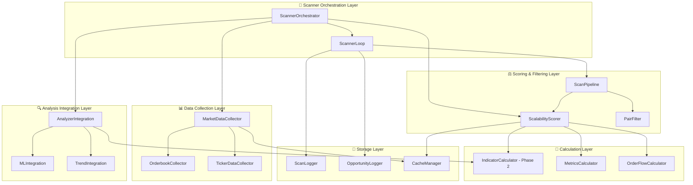

# PHASE 3 - SCANNER REFACTORING ROADMAP
## Trade Cursor v7.0 - Découplage et Modularisation Scanner

---

## 🎯 **OBJECTIFS PHASE 3**

### **Mission Principale**
Refactoriser le **Scanner** pour qu'il utilise une architecture découplée et modulaire, similaire aux Phases 1 & 2, tout en maintenant les performances et la compatibilité.

### **Résultats Attendus**
- **Architecture modulaire** avec interfaces claires
- **Composants testables** indépendamment
- **Intégration transparente** avec Analyzer & Position Manager Phase 2
- **Performance maintenue** ou améliorée
- **Migration progressive** via feature flags

---

## 📋 **ANALYSE ARCHITECTURE ACTUELLE**

### **Composants Identifiés**

#### **1. ScalabilityScanner (`core/scanner.py`)**
```python
# Responsabilités actuelles (TROP NOMBREUSES):
- fetch_spread_data() → Récupération orderbook/spread
- calculate_score() → Scoring de scalabilité  
- scan_pair() → Scan individuel avec indicateurs
- scan_top_pairs() → Orchestration scan batch
- calculate_volatility/atr/adx() → Calculs techniques
- fetch_funding_rate/volume_24h() → Données marché
- calculate_orderflow_metrics() → Métriques ML

# Problèmes identifiés:
✗ Couplage fort avec API MEXC
✗ Responsabilités multiples (Single Responsibility Violation)
✗ Difficile à tester unitairement
✗ Cache intégré mais non configurable
✗ Gestion d'erreurs mélangée avec logique métier
```

#### **2. Scanner Loop (`core/callbacks/scanner_loop.py`)**
```python
# Fonction scan_pair_for_setup() - 1400+ lignes:
- Orchestration analyse complète
- Intégration TechnicalAnalyzer
- Logging PostgreSQL (scan_logs + opportunities)
- Calculs ML predictions
- Market Regime integration
- Trend data calculation
- Gestion confluence et filters

# Problèmes identifiés:
✗ Fonction monolithique (1400+ lignes)
✗ Couplage fort avec tous les composants
✗ Logique métier mélangée avec orchestration
✗ Difficile à déboguer et maintenir
✗ Tests impossibles sans infrastructure complète
```

#### **3. Technical Analyzer (`core/analyzer.py`)**
```python
# Déjà partiellement refactorisé en Phase 2:
- analyze_pair() → Multi-timeframe analysis
- analyze_timeframe() → Single timeframe
- calculate_trend_data() → Trend analysis

# Statut:
✅ Interfaces Phase 2 disponibles
✅ TestableAnalyzerV2 implémenté
⚠️ Intégration Scanner à migrer vers Phase 2
```

---

## 🏗️ **ARCHITECTURE CIBLE PHASE 3**

### **Décomposition Modulaire**



### **Interfaces Principales**

#### **1. IMarketDataCollector**
```python
@abstractmethod
async def collect_orderbook(self, symbol: str) -> OrderbookData
async def collect_ticker(self, symbol: str) -> TickerData  
async def collect_ohlcv(self, symbol: str, timeframe: str) -> OHLCVData
async def collect_funding_rate(self, symbol: str) -> float
```

#### **2. IScalabilityScorer**
```python
@abstractmethod  
def calculate_score(self, pair_data: PairData) -> ScoringResult
def calculate_metrics(self, market_data: MarketData) -> MetricsResult
def filter_pairs(self, pairs: List[PairData], filters: FilterConfig) -> List[PairData]
```

#### **3. IScannerOrchestrator**
```python
@abstractmethod
async def scan_single_pair(self, symbol: str) -> ScanResult
async def scan_batch_pairs(self, symbols: List[str]) -> Dict[str, ScanResult]  
async def scan_top_pairs(self, limit: int) -> List[ScanResult]
def get_scan_statistics(self) -> ScanStats
```

#### **4. IScanPipeline**
```python
@abstractmethod
async def execute_scan_pipeline(self, symbol: str) -> PipelineResult
def add_pipeline_step(self, step: IScanStep) -> None
def configure_pipeline(self, config: PipelineConfig) -> None
```

---

## 📦 **COMPOSANTS À DÉVELOPPER**

### **Phase 3A - Data Collection (Semaines 1-2)**

#### **1. TestableMarketDataCollector**
```python
# Responsabilités:
- Collecte orderbook avec cache intelligent
- Collecte ticker data (prix, volume 24h)
- Collecte OHLCV multi-timeframe
- Collecte funding rates
- Gestion erreurs robuste (Network/API/Data)
- Cache configurabel avec TTL

# Bénéfices:
✅ Découplage de l'API MEXC
✅ Cache partagé entre composants
✅ Mocking facile pour tests
✅ Gestion d'erreurs centralisée
```

#### **2. TestableOrderbookCollector**
```python
# Responsabilités:
- fetch_spread_data() refactorisé
- Calcul spread, depth, balance
- Order flow metrics (delta volume, imbalance)
- Direction bias calculation
- Cache orderbook intelligent

# Optimisations:
✅ Cache TTL configurable
✅ Batch collection support
✅ Error handling par type
✅ Metrics collection
```

### **Phase 3B - Scoring & Filtering (Semaines 2-3)**

#### **3. TestableScalabilityScorer**
```python
# Responsabilités:
- calculate_score() découplé
- Scoring configurable par régime
- Filter chains configurables
- Metrics calculation (ATR, volatility, ADX)
- Rejection reason tracking

# Améliorations:
✅ Régime-aware scoring
✅ Configurable weights
✅ Rejection analytics  
✅ A/B testing support
```

#### **4. TestablePairFilter** 
```python
# Responsabilités:
- Filtrage par spread/volume/funding
- Exclude/whitelist management
- Fee filtering (0-fee only)
- Market hours filtering
- Custom filter chains

# Flexibilité:
✅ Chainable filters
✅ Configuration dynamique
✅ Stats par filter type
✅ Performance monitoring
```

### **Phase 3C - Pipeline & Orchestration (Semaines 3-4)**

#### **5. TestableScanPipeline**
```python
# Responsabilités:
- Pipeline steps configurable
- Data flow entre steps
- Error handling & retry
- Performance monitoring
- Parallel execution support

# Pipeline Steps:
1. Data Collection Step
2. Scoring Step  
3. Filtering Step
4. Analysis Integration Step
5. ML Prediction Step
6. Logging Step

# Avantages:
✅ Steps ajoutables/removables
✅ Configuration par environnement
✅ Debugging per step
✅ Performance profiling
```

#### **6. TestableScannerOrchestrator**
```python
# Responsabilités:
- Coordination scan multi-symboles
- Integration avec Analyzer Phase 2
- ML predictions integration
- PostgreSQL logging coordination
- Cache management global
- Statistics & monitoring

# Orchestration:
✅ Parallel scanning configurabel
✅ Integration seamless Phase 2
✅ Error recovery strategies
✅ Performance optimization
✅ Feature flag integration
```

---

## 🔄 **MIGRATION STRATEGY**

### **Approche Progressive**

#### **Étape 1: Wrapper Legacy (Feature Flag 0%)**
```python
class LegacyScannerWrapper(IScannerOrchestrator):
    """Wrapper autour du scanner actuel"""
    def __init__(self):
        self.legacy_scanner = ScalabilityScanner()
    
    async def scan_single_pair(self, symbol: str) -> ScanResult:
        # Déléguer au scanner legacy
        legacy_result = await self.legacy_scanner.scan_pair(symbol)
        # Convertir au nouveau format
        return self._convert_legacy_result(legacy_result)
```

#### **Étape 2: Implémentation Progressive (Feature Flag 25%)**
```python 
# Remplacer composant par composant:
1. MarketDataCollector (remplace fetch_*)
2. ScalabilityScorer (remplace calculate_score)
3. ScanPipeline (remplace logique scan_top_pairs)
4. Integration avec Analyzer Phase 2
```

#### **Étape 3: Migration Complète (Feature Flag 75%)**
```python
# Scanner complet Phase 3:
- Tous composants Phase 3 actifs
- Integration transparente Phase 1 & 2  
- Performance monitoring actif
- Rollback capability maintenue
```

#### **Étape 4: Deprecation Legacy (Feature Flag 100%)**
```python
# Cleanup:
- Suppression code legacy scanner
- Documentation migration complète
- Tests end-to-end validés
- Performance benchmarks passed
```

---

## 📊 **FEATURE FLAGS CONFIGURATION**

### **Scanner Phase 3 Feature Flags**

```json
{
    "use_testable_scanner": {
        "enabled": false,
        "rollout_percentage": 0.0,
        "description": "Enable Phase 3 Scanner components",
        "depends_on": ["use_testable_analyzer"]
    },
    "scanner_comparison_mode": {
        "enabled": true, 
        "rollout_percentage": 100.0,
        "description": "Compare legacy vs Phase 3 scanner performance"
    },
    "use_testable_market_data_collector": {
        "enabled": false,
        "rollout_percentage": 0.0,
        "description": "Enable Phase 3 Market Data Collector"
    },
    "use_testable_scalability_scorer": {
        "enabled": false,
        "rollout_percentage": 0.0, 
        "description": "Enable Phase 3 Scalability Scorer"
    },
    "use_testable_scan_pipeline": {
        "enabled": false,
        "rollout_percentage": 0.0,
        "description": "Enable Phase 3 Scan Pipeline"
    }
}
```

---

## 🧪 **STRATÉGIE DE TESTS**

### **Tests Unitaires Composants**
```python
# Tests pour chaque composant découplé:
- TestMarketDataCollectorTest
- TestScalabilityScorerTest  
- TestPairFilterTest
- TestScanPipelineTest
- TestScannerOrchestratorTest

# Coverage target: 90%+ pour chaque composant
```

### **Tests d'Intégration** 
```python
# Tests end-to-end:
- Legacy vs Phase 3 comparison
- Performance benchmarks
- Error handling scenarios
- Cache behavior validation
- Feature flag transitions

# Scenarios critiques:
- Scan 50+ pairs performance
- Network error resilience
- Cache hit/miss optimization
- Memory usage under load
```

### **Tests de Performance**
```python
# Benchmarks à maintenir/améliorer:
- Scan 20 pairs: < 5 secondes
- Single pair scan: < 250ms
- Cache hit rate: > 80%
- Memory usage: < 500MB
- Error rate: < 1%

# Monitoring metrics:
- Latency P50, P95, P99
- Throughput (pairs/sec)
- Error rate by component
- Cache efficiency
- Resource utilization
```

---

## 📈 **MÉTRIQUES DE SUCCÈS**

### **Performance**
- ✅ **Latency:** Maintenir ou améliorer temps scan (-10% target)
- ✅ **Throughput:** Support 50+ pairs simultanées
- ✅ **Memory:** < 512MB peak usage
- ✅ **Cache Hit Rate:** > 85%
- ✅ **Error Rate:** < 0.5%

### **Qualité Code**
- ✅ **Test Coverage:** > 90% composants core
- ✅ **Cyclomatic Complexity:** < 10 per method
- ✅ **Maintainability Index:** > 80
- ✅ **Dependency Injection:** 100% composants
- ✅ **Interface Compliance:** 100%

### **Business Impact**
- ✅ **Opportunity Detection:** Maintenir 100% accuracy
- ✅ **False Positives:** < 2% increase acceptable
- ✅ **Scan Frequency:** Maintenir ou améliorer
- ✅ **System Stability:** Zero critical errors
- ✅ **Feature Flag Rollout:** Smooth 0% → 100%

---

## 🗓️ **TIMELINE DÉTAILLÉ**

### **Semaine 1-2: Data Collection Layer**
- [ ] **Jour 1-2:** Créer interfaces IMarketDataCollector, IOrderbookCollector
- [ ] **Jour 3-5:** Implémenter TestableMarketDataCollector
- [ ] **Jour 6-7:** Implémenter TestableOrderbookCollector  
- [ ] **Jour 8-10:** Tests unitaires et validation cache
- [ ] **Jour 11-12:** Wrapper legacy + feature flags setup

### **Semaine 2-3: Scoring & Filtering Layer**
- [ ] **Jour 13-14:** Créer interfaces IScalabilityScorer, IPairFilter
- [ ] **Jour 15-17:** Implémenter TestableScalabilityScorer
- [ ] **Jour 18-19:** Implémenter TestablePairFilter
- [ ] **Jour 20-21:** Integration avec Data Collection Layer
- [ ] **Jour 22-24:** Tests intégration + scoring validation

### **Semaine 3-4: Pipeline & Orchestration**
- [ ] **Jour 25-26:** Créer interfaces IScanPipeline, IScannerOrchestrator  
- [ ] **Jour 27-29:** Implémenter TestableScanPipeline
- [ ] **Jour 30-32:** Implémenter TestableScannerOrchestrator
- [ ] **Jour 33-34:** Integration complète avec Analyzer Phase 2
- [ ] **Jour 35-36:** Tests end-to-end et performance benchmarks

### **Semaine 4-5: Integration & Rollout**
- [ ] **Jour 37-38:** Factory pattern extension
- [ ] **Jour 39-40:** Feature flags activation progressive (0% → 25%)
- [ ] **Jour 41-42:** Monitoring et debugging
- [ ] **Jour 43-44:** Performance tuning et optimizations
- [ ] **Jour 45-47:** Documentation et guides utilisateur
- [ ] **Jour 48:** Préparation rollout 50%

---

## 🚨 **RISQUES ET MITIGATION**

### **Risques Techniques**

#### **Performance Dégradée**
- **Risque:** Scanner Phase 3 plus lent que legacy
- **Mitigation:** Benchmarks continus, cache intelligent, profiling
- **Rollback:** Feature flag à 0% immédiatement

#### **Bugs Critiques**
- **Risque:** Opportunités manquées ou faux positifs
- **Mitigation:** Tests exhaustifs, comparison mode, monitoring alertes
- **Rollback:** Automatic rollback si error rate > 2%

#### **Intégration Complexe**
- **Risque:** Incompatibilité avec Phase 1 & 2 
- **Mitigation:** Tests intégration continus, interfaces versionnées
- **Rollback:** Wrapper legacy maintenu pendant transition

### **Risques Business**

#### **Downtime**
- **Risque:** Interruption service pendant migration
- **Mitigation:** Migration progressive, blue-green deployment
- **Rollback:** Hot-swap vers legacy en < 30 secondes

#### **Opportunities Loss**  
- **Risque:** Détection réduite pendant transition
- **Mitigation:** Comparison mode actif, monitoring profits
- **Rollback:** Revert si profit impact > 5%

---

## 🎯 **CRITÈRES DE SUCCÈS**

### **Phase 3A - Data Collection** ✅
- [ ] All interfaces créées et documentées
- [ ] TestableMarketDataCollector fonctionnel
- [ ] Cache system optimisé (hit rate > 80%)
- [ ] Tests unitaires > 90% coverage
- [ ] Integration avec legacy via wrapper

### **Phase 3B - Scoring & Filtering** ✅
- [ ] TestableScalabilityScorer équivalent legacy
- [ ] TestablePairFilter configurable
- [ ] Performance maintenue ou améliorée
- [ ] Rejection tracking et analytics
- [ ] Integration tests passent 100%

### **Phase 3C - Pipeline & Orchestration** ✅
- [ ] TestableScanPipeline modulaire
- [ ] TestableScannerOrchestrator complet
- [ ] Integration seamless Analyzer Phase 2
- [ ] End-to-end tests passent 100%
- [ ] Performance benchmarks atteints

### **Migration Complete** ✅
- [ ] Feature flags 0% → 100% successful
- [ ] Legacy code deprecated safely
- [ ] Documentation utilisateur complete
- [ ] Training équipe terminé
- [ ] Monitoring dashboards actifs

---

## 📋 **CHECKLIST PRÉ-ROLLOUT**

### **Code Quality** ✅
- [ ] All interfaces implémentées
- [ ] Test coverage > 90%
- [ ] Code review passed
- [ ] Performance tests passed
- [ ] Security audit passed

### **Integration** ✅  
- [ ] Phase 1 Position Manager compatible
- [ ] Phase 2 Analyzer integration tested
- [ ] PostgreSQL logging functional
- [ ] ML pipeline integration tested
- [ ] WebSocket integration validated

### **Monitoring** ✅
- [ ] Dashboards Phase 3 créés
- [ ] Alerts configurées
- [ ] Logging centralisé
- [ ] Metrics collection active
- [ ] Error tracking operational

### **Documentation** ✅
- [ ] Architecture docs complete
- [ ] API documentation generated  
- [ ] Migration guides written
- [ ] Troubleshooting guides ready
- [ ] Training materials prepared

---

## 🏁 **CONCLUSION PHASE 3**

La Phase 3 complètera la **transformation complète** de Trade Cursor v7.0 vers une **architecture modulaire, testable et maintenable**.

### **Impact Final**
- **Scanner découplé** et modulaire
- **Performance optimisée** avec cache intelligent
- **Intégration seamless** Phase 1 & 2
- **Tests complets** pour stability
- **Monitoring avancé** pour operations

### **Préparation Phase 4**
- **100% refactoring** Position Manager + Analyzer + Scanner
- **Feature flags migration** vers configuration permanente
- **Documentation architecture** complète
- **Training équipe** sur nouvelle architecture
- **Optimisations performance** continues

**🎯 TRADE CURSOR V7.0 - PHASE 3 SCANNER REFACTORING: ROADMAP READY! ✅**

---

*Document créé le: 23 Janvier 2026*  
*Version: Phase3-Roadmap-v1.0*  
*Statut: 🚀 READY TO START*
