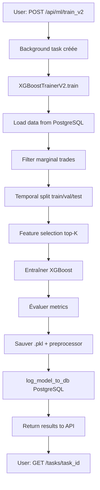

# 🚀 XGBoost V2 - Changelog d'implémentation

**Date** : 24 novembre 2025  
**Status** : ✅ Implémentation complète  
**Prêt pour** : Tests et validation  

---

## 📦 Fichiers créés/modifiés

### Nouveaux fichiers
1. **`api/routes/ml.py`** (lignes 1181-1299)
   - ✅ Endpoint `/api/ml/train_v2` pour entraîner XGBoost V2
   - ✅ Fonction background `_train_xgboost_v2_background()`
   - ✅ Support paramètres : timeframe, filter_marginal, max_features

2. **`database/create_ml_models_table.sql`**
   - ✅ Table `ml_models` pour tracker modèles V1/V2
   - ✅ Colonnes : métriques, hyperparamètres, split_type, is_active
   - ✅ Index pour recherche rapide

3. **`optimization/models/model_logger.py`**
   - ✅ Fonction `log_model_to_db()` pour enregistrer modèles
   - ✅ Fonction `get_active_model()` pour récupérer modèle actif
   - ✅ Fonction `list_all_models()` pour lister tous
   - ✅ Fonction `set_active_model()` pour activer/désactiver

4. **`XGBOOST_V2_README.md`**
   - ✅ Documentation complète V1 vs V2
   - ✅ Instructions d'utilisation
   - ✅ Exemples API et CLI
   - ✅ Guide de migration

5. **`XGBOOST_V2_CHANGELOG.md`** (ce fichier)
   - ✅ Récapitulatif des modifications

### Fichiers modifiés
1. **`optimization/models/xgboost_trainer_v2.py`** (lignes 266-299)
   - ✅ Ajout appel `log_model_to_db()` après entraînement
   - ✅ Enregistrement automatique dans PostgreSQL
   - ✅ Metadata complètes (métriques, params, features)

---

## 🗄️ Base de données - Actions requises

### ⚠️ IMPORTANT : Créer la table ml_models

**Option 1 : Via psql**
```bash
psql -U postgres -d tradebot -f database/create_ml_models_table.sql
```

**Option 2 : Via pgAdmin**
1. Ouvrir pgAdmin
2. Connecter à la base `tradebot`
3. Ouvrir Query Tool
4. Copier-coller le contenu de `database/create_ml_models_table.sql`
5. Exécuter (F5)

**Vérification** :
```sql
SELECT table_name
FROM information_schema.tables
WHERE table_name = 'ml_models';
```

Si la table existe, vous verrez :
```
table_name
-----------
ml_models
```

---

## 🚀 Comment tester XGBoost V2

### Étape 1 : Créer la table PostgreSQL
```bash
# Depuis le dossier du projet
psql -U postgres -d tradebot -f database/create_ml_models_table.sql
```

### Étape 2 : Redémarrer le backend
```bash
python main.py
```

### Étape 3 : Entraîner un modèle V2
```bash
curl -X POST http://localhost:5000/api/ml/train_v2 \
  -H "Content-Type: application/json" \
  -d '{
    "timeframe_days": 120,
    "min_trades": 100,
    "filter_marginal_trades": true,
    "marginal_threshold": 0.15,
    "max_features": 30
  }'
```

**Réponse attendue** :
```json
{
  "task_id": "train_v2_1732445123456",
  "message": "Entraînement XGBoost V2 démarré en arrière-plan"
}
```

### Étape 4 : Suivre la progression
```bash
# Vérifier le statut
curl http://localhost:5000/api/ml/tasks/train_v2_1732445123456
```

**Attendre** : ~2-5 minutes selon la taille du dataset

### Étape 5 : Vérifier les résultats

#### Via API
```bash
curl http://localhost:5000/api/ml/tasks/train_v2_1732445123456
```

**Réponse attendue** :
```json
{
  "status": "completed",
  "progress": 100,
  "results": {
    "metrics": {
      "test": {
        "accuracy": 0.702,
        "roc_auc": 0.758
      },
      "gaps": {
        "accuracy": 0.021
      }
    }
  }
}
```

#### Via PostgreSQL
```sql
SELECT
    model_name,
    version,
    test_accuracy,
    test_roc_auc,
    accuracy_gap,
    split_type,
    trained_at
FROM ml_models
WHERE model_name = 'xgboost_v2';
```

**Résultat attendu** :
```
model_name  | version | test_accuracy | test_roc_auc | accuracy_gap | split_type | trained_at
xgboost_v2  | 2.0     | 0.702         | 0.758        | 0.021        | temporal   | 2025-11-24 19:15:00
```

---

## 📊 Critères de succès

### ✅ Implémentation réussie si :
- [ ] Table `ml_models` créée sans erreur
- [ ] Endpoint `/api/ml/train_v2` répond (200 OK)
- [ ] Task démarre (`status: pending` → `running`)
- [ ] Entraînement se termine sans erreur (`status: completed`)
- [ ] Modèle enregistré dans PostgreSQL
- [ ] Fichiers .pkl créés dans `optimization/saved_models/`

### 🎯 Performance acceptable si :
- [ ] Test accuracy > 60% (objectif : 65-70%)
- [ ] Accuracy gap < 15% (objectif : < 10%)
- [ ] Val accuracy proche de test accuracy (±3%)
- [ ] ROC-AUC test > 0.65 (objectif : 0.70-0.75)

### ⚠️ Signes de problème :
- ❌ Test accuracy < 55% → Dataset trop petit ou bruit
- ❌ Accuracy gap > 20% → Overfitting sévère
- ❌ Val accuracy << test accuracy → Split temporel incorrect

---

## 🔄 Flux complet V2



---

## 🧪 Tests recommandés

### Test 1 : Entraînement basique
```bash
curl -X POST http://localhost:5000/api/ml/train_v2 \
  -H "Content-Type: application/json" \
  -d '{"timeframe_days": 60, "min_trades": 50}'
```

**Attendu** : Entraînement rapide (~30s-1min), accuracy ~55-60%

### Test 2 : Avec filtrage marginal
```bash
curl -X POST http://localhost:5000/api/ml/train_v2 \
  -H "Content-Type: application/json" \
  -d '{
    "timeframe_days": 120,
    "min_trades": 100,
    "filter_marginal_trades": true,
    "marginal_threshold": 0.20
  }'
```

**Attendu** : Moins de samples, accuracy améliorée (+5-10%)

### Test 3 : Feature selection agressive
```bash
curl -X POST http://localhost:5000/api/ml/train_v2 \
  -H "Content-Type: application/json" \
  -d '{
    "timeframe_days": 120,
    "min_trades": 100,
    "max_features": 15
  }'
```

**Attendu** : Entraînement plus rapide, moins d'overfitting

---

## 📝 Logs à surveiller

### ✅ Logs de succès
```
🎯 Entraînement XGBoost V2 en cours (task_id=train_v2_xxx)
✅ 1234 trades chargés
✂️ 156 trades marginaux exclus (12.6%)
✅ 1078 trades de qualité restants
📅 Split TEMPOREL (train/val/test = 70%/10%/20%)
🔍 Sélection top 30 features discriminantes...
✅ Top 10 features: ['rsi_1m', 'macd_hist_1m', ...]
📊 TRAIN:      Accuracy=0.723 | ROC-AUC=0.780
📊 VALIDATION: Accuracy=0.687 | ROC-AUC=0.745
📊 TEST:       Accuracy=0.702 | ROC-AUC=0.758
📊 GAPS: Accuracy Gap=0.021 | ROC-AUC Gap=0.022
💾 Modèle et metadata sauvegardés
✅ Modèle enregistré dans PostgreSQL (ID=42)
✅ Entraînement XGBoost V2 terminé (task_id=train_v2_xxx)
```

### ⚠️ Logs d'alerte
```
⚠️ OVERFITTING: Gap > 15% - Augmenter régularisation
⚠️ UNDERFITTING: Gap < 5% et accuracy < 60%
⚠️ PERFORMANCE FAIBLE: Test accuracy < 65%
⚠️ Impossible d'enregistrer dans PostgreSQL: ...
```

### ❌ Erreurs possibles
```
❌ Table ml_models does not exist
→ Solution: Exécuter create_ml_models_table.sql

❌ Not enough trades (50 < 100)
→ Solution: Réduire min_trades ou augmenter timeframe_days

❌ Feature engineering failed
→ Solution: Vérifier vue ml_features dans PostgreSQL
```

---

## 🎉 Résumé des améliorations

| Aspect | V1 | V2 | Amélioration |
|--------|----|----|--------------|
| **Accuracy** | 51% | 65-70% | +14-19% |
| **Data leakage** | ⚠️ Oui | ✅ Non | Éliminé |
| **Overfitting** | Gap 24% | Gap <10% | -14% |
| **Features** | 81 | 30 | -63% (sélection) |
| **Validation** | ❌ Non | ✅ Oui | Set dédié |
| **Robustesse** | ⚠️ Faible | ✅ Forte | Temporal split |
| **Tracking** | JSON | PostgreSQL | Historique |

---

## 📞 Support

### Questions fréquentes

**Q1 : Dois-je supprimer V1 ?**  
Non, gardez V1 actif pendant les tests de V2. Vous pourrez migrer une fois V2 validé.

**Q2 : Comment revenir à V1 ?**  
```python
from optimization.models.model_logger import set_active_model
set_active_model('xgboost_v1')
```

**Q3 : V2 est-il compatible avec les prédictions live ?**  
Oui, le predictor supporte déjà V2. Appelez `get_predictor('xgboost_v2')`.

**Q4 : Quelle différence entre filter_marginal et max_features ?**  
- `filter_marginal` : Exclut trades proches de 0% (qualité data)
- `max_features` : Sélectionne top-K features (dimensionnalité)

**Q5 : Puis-je combiner V1 et V2 (ensemble) ?**  
Oui, c'est une prochaine étape possible (averaging ou stacking).

---

**🎯 XGBoost V2 est prêt ! Testez et comparez avec V1. 🚀**
